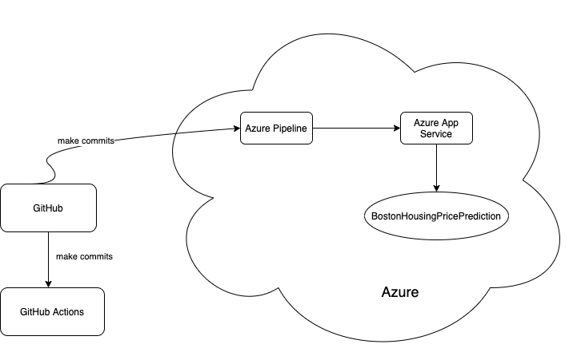
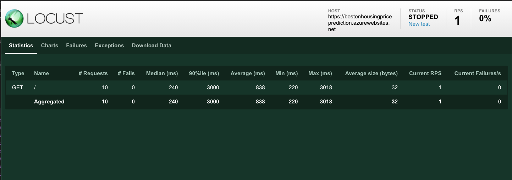

# Overview

BostonHousingPricePrediction is a web app that hosted on Azure App Service to predict the housing price at Boston.

## Project Plan

* [A link to a Trello board for the project](https://trello.com/b/f0h9Nuuu/az2-build-ci-cd-pipeline-5-29)

* [A link to a spreadsheet that includes the original and final project plan](https://docs.google.com/spreadsheets/d/1dWaVzakvCpGNrWAXU-JxqgsjDw-sZNddCc69C8quTYc/edit?usp=sharing)

## Instructions

* Architectural Diagram

* Instructions

* Project running on Azure App Service

* Project cloned into Azure Cloud Shell

* Passing tests that are displayed after running the `make all` command from the `Makefile`

* Output of a test run

* Successful deploy of the project in Azure Pipelines.  [Note the official documentation should be referred to and double checked as you setup CI/CD](https://docs.microsoft.com/en-us/azure/devops/pipelines/ecosystems/python-webapp?view=azure-devops).

* Running Azure App Service from Azure Pipelines automatic deployment

* Successful prediction from deployed flask app in Azure Cloud Shell.  [Use this file as a template for the deployed prediction](https://github.com/udacity/nd082-Azure-Cloud-DevOps-Starter-Code/blob/master/C2-AgileDevelopmentwithAzure/project/starter_files/flask-sklearn/make_predict_azure_app.sh).
The output should look similar to this:

* Output of streamed log files from deployed application

* Locust: load test output

> 

## Enhancements

Plan : May add a friendly user interface to it.

## Demo 
https://youtu.be/57mUqMczNWY

Step 1: 0:20 Working Azure Cloud Shell environment for Continuous Integration. 
 
Step 2: 1:31 Successful machine learning prediction that returns back a JSON payload. 
 
Step 3: 2:46 Working GitHub Actions build 
 
Step 4: 4:27 Successful deployment using Continuous Delivery on the Azure platform. 

